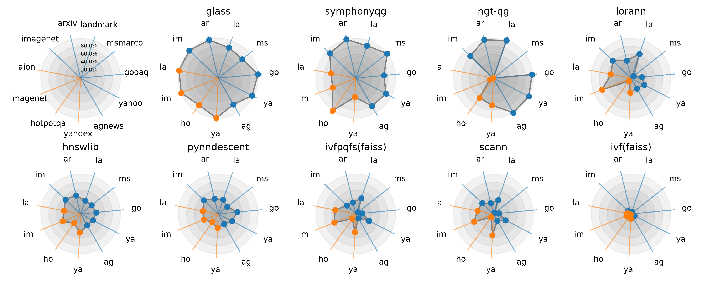

<div align="center">
<b>Vector Index Benchmark for Embeddings (VIBE)</b> is an extensible benchmark for approximate nearest neighbor search methods, or vector indexes, using modern embedding datasets.
</div>
<br/>

<div align="center">
    <a href="https://vector-index-bench.github.io"></a>
    <a href="https://arxiv.org/pdf/2505.17810"></a>
    <a href="https://github.com/vector-index-bench/vibe/blob/master/LICENSE"></a>
    <a href="https://github.com/vector-index-bench/vibe/stargazers"></a>
</div>

## Overview

- 📊 Modern vector index benchmark with embedding datasets
- 🎯 Includes datasets for both in-distribution and out-out-distribution settings
- 🏆 Includes the most comprehensive collection of state-of-the-art vector search algorithms
- 💎 Support for quantized datasets in both 8-bit integer and binary precision
- 🖥️ Support for HPC environments with Slurm and NUMA
- 🚀 Support for GPU algorithms

### Results
The current VIBE results can be viewed on our website:

https://vector-index-bench.github.io

The website also features several other tools and visualizations to explore the results.

The results are run on Intel Xeon Gold 6230 (Cascade Lake) CPUs with support for AVX-512 instructions. All algorithms are benchmarked using a single core. The GPU algorithms are run using an NVIDIA V100 (32 GB). The next results update will use AMD Turin 9965 CPUs, while GPU algorithms will be run using NVIDIA GH200 (96 GB).

### Publication
E. Jääsaari, V. Hyvönen, M. Ceccarello, T. Roos, M. Aumüller. [VIBE: Vector Index Benchmark for Embeddings](https://arxiv.org/pdf/2505.17810). _arXiv preprint arXiv:2505.17810_, 2025.

### Authors
VIBE is maintained by [Elias Jääsaari](https://github.com/ejaasaari), [Matteo Ceccarello](https://github.com/Cecca), and [Martin Aumüller](https://github.com/maumueller).

### Alternative Benchmarks
Please check out [big-ann-benchmarks](https://github.com/harsha-simhadri/big-ann-benchmarks/) (NeurIPS 2021/2023) for the state-of-the-art in billion-scale ANN and constrained ANN, such as ANN under filtered or sparse workloads.

### Credits
The evaluation code and some algorithm implementations in VIBE are based on the [ann-benchmarks](https://github.com/erikbern/ann-benchmarks/) project.

### License
VIBE is available under the MIT License (see [LICENSE](LICENSE)). The [pyyaml](https://github.com/yaml/pyyaml) library is also distributed in the [vibe](vibe) folder under the MIT License.

## Getting started

### Requirements

- Linux
- [Apptainer](https://apptainer.org/docs/admin/main/installation.html#install-from-pre-built-packages) (or [Singularity](https://docs.sylabs.io/guides/4.3/user-guide/quick_start.html))
- Python 3.6 or newer

For example, to install Apptainer on Ubuntu:
```sh
sudo add-apt-repository -y ppa:apptainer/ppa
sudo apt update
sudo apt install -y apptainer
```

Some algorithms may require that the CPU supports AVX-512 instructions and some algorithms may require an Intel CPU due to a dependency on Intel MKL. The GPU algorithms assume that an NVIDIA GPU is available.

> [!IMPORTANT]
> For accurate benchmarking, it is recommended to disable SMT/hyperthreading:
> 
> ```echo off | sudo tee /sys/devices/system/cpu/smt/control```
>
> On hybrid architectures (e.g., Intel Raptor Lake), it is recommended to disable efficiency (E) cores.
>
> If not running in an HPC or cloud environment, it is also recommended to set the performance governor
>
> ```sudo cpupower frequency-set -g performance```
>
> and to check that transparent huge pages are set to `madvise` or `never`:
>
> ```cat /sys/kernel/mm/transparent_hugepage/enabled```

### Building library images

Building all library images can be done using
```sh
./install.sh
```

Use `./install.sh --skip-gpu` if you don't need to benchmark GPU methods. To build an image for a single library:

```sh
./install.sh --algorithm hnswlib
```

> [!TIP]
> `install.sh` takes an argument `--build-dir` that specifies the temporary build directory. For example, to speed up the build in a cluster environment, you can set the build directory to a location on an SSD while the project files are on a slower storage medium.

> [!TIP]
> See an [example Slurm job](slurm/install.sh) for building the libraries using Slurm.

### Running benchmarks

The benchmarks for a single dataset can be run using `run.py`. For example:

```sh
python3 run.py --dataset agnews-mxbai-1024-euclidean
```

The run.py script does not depend on any external libraries and can therefore be used without a container or a virtual environment.

Common options for run.py:
- `--parallelism n`: Use `n` processes for benchmarking.
- `--module mod`: Run the benchmark only for algorithms in module (library) `mod`.
- `--algorithm algo`: Run the benchmark for only algorithm `algo`.
- `--count k`: Run the benchmarks using `k` nearest neighbors (default 100).
- `--gpu`: Run the benchmark in GPU mode.

For all options, see
```sh
python3 run.py --help
```

The benchmark should take less than 24 hours to run for a given dataset using parallelism > 12. We recommend having at least 16 GB of memory per used core.

> [!TIP]
> See an [example Slurm job](slurm/run.sh) for running the benchmark using Slurm.

### Plotting results

You should first build the `plot.sif` image:
```sh
singularity build plot.sif plot.def
```

Before plotting, the current results must first be exported:
```sh
./export_results.sh --parallelism 8
```

The results for a dataset can then plotted with e.g.:
```sh
./plot.sh --dataset agnews-mxbai-1024-euclidean
```

To plot the radar chart above, use:
```sh
./plot.sh --plot-type radar
```

For all available options, see:
```
./plot.sh --help
```

> [!TIP]
> You can also use [uv](https://docs.astral.sh/uv/) to directly run `export_results.py` and `plot.py` without building the container image if preferable. The arguments for these scripts are the same as above.

### Creating datasets from scratch

The benchmark code downloads precomputed embedding datasets. However, the datasets can also be recreated from scratch, and it is also possible to create new datasets by modifying the [datasets.py](vibe/datasets.py) file.

Creating the datasets can be done using `create_dataset.sh`. It first requires that `dataset.sif` is built:
```sh
singularity build dataset.sif dataset.def
```

The `VIBE_CACHE` environment variable should be set to a cache directory with at least 200 GB of free space when creating image embeddings using the Landmark or ImageNet datasets. Datasets can then be created using the `--dataset argument` (the `--nv` argument specifies that an available GPU can be used):
```sh
export VIBE_CACHE=$LOCAL_SCRATCH
./create_dataset.sh --singularity-args "--bind $LOCAL_SCRATCH:$LOCAL_SCRATCH --nv" --dataset agnews-mxbai-1024-euclidean
```

> [!TIP]
> See an [example Slurm job](slurm/dataset.sh) for creating datasets using Slurm.

### Adding a new method to the benchmark

VIBE is an on-going effort and we actively welcome new additions to the benchmarks.

Add your algorithm in the folder `vibe/algorithms/{METHOD}/` by providing

- Python wrapper in module.py
- Singularity container defination in image.def
- Hyperparameter grid in config.yml

Please refer to e.g. the [hnswlib module](https://github.com/vector-index-bench/vibe/tree/main/vibe/algorithms/hnswlib) for a reference implementation.

### Running the website locally

The results website can be run locally by following the instructions in the [website repository](https://github.com/vector-index-bench/vector-index-bench.github.io).

## Evaluation

### In-distribution datasets

| Name | Type | n | d | Distance |
|---|---|---|---|---|
| [agnews-mxbai-1024-euclidean](https://huggingface.co/datasets/vector-index-bench/vibe/blob/main/agnews-mxbai-1024-euclidean.hdf5) | Text | 769,382 | 1024 | euclidean |
| [arxiv-nomic-768-normalized](https://huggingface.co/datasets/vector-index-bench/vibe/blob/main/arxiv-nomic-768-normalized.hdf5) | Text | 1,344,643 | 768 | any |
| [dpr-jina-768-normalized](https://huggingface.co/datasets/vector-index-bench/vibe/blob/main/dpr-jina-768-normalized.hdf5) | Text | 20,969,760 | 768 | any |
| [glove-200-cosine](https://huggingface.co/datasets/vector-index-bench/vibe/blob/main/glove-200-cosine.hdf5) | Word | 1,192,514 | 200 | cosine |
| [gooaq-distilroberta-768-normalized](https://huggingface.co/datasets/vector-index-bench/vibe/blob/main/gooaq-distilroberta-768-normalized.hdf5) | Text | 1,475,024 | 768 | any |
| [imagenet-clip-512-normalized](https://huggingface.co/datasets/vector-index-bench/vibe/blob/main/imagenet-clip-512-normalized.hdf5) | Image | 1,281,167 | 512 | any |
| [inaturalist-resnet-2048-cosine](https://huggingface.co/datasets/vector-index-bench/vibe/blob/main/inaturalist-resnet-2048-cosine.hdf5) | Image | 499,000 | 2048 | cosine |
| [landmark-dino-768-cosine](https://huggingface.co/datasets/vector-index-bench/vibe/blob/main/landmark-dino-768-cosine.hdf5) | Image | 760,757 | 768 | cosine |
| [landmark-nomic-768-normalized](https://huggingface.co/datasets/vector-index-bench/vibe/blob/main/landmark-nomic-768-normalized.hdf5) | Image | 760,757 | 768 | any |
| [msmarco-qwen-1024-normalized](https://huggingface.co/datasets/vector-index-bench/vibe/blob/main/msmarco-qwen-1024-normalized.hdf5) | Text | 8,840,823 | 1024 | any |
| [yahoo-minilm-384-normalized](https://huggingface.co/datasets/vector-index-bench/vibe/blob/main/yahoo-minilm-384-normalized.hdf5) | Text | 677,305 | 384 | any |

### Out-of-distribution datasets

| Name | Type | n | d | Distance |
|---|---|---|---|---|
| [hotpotqa-harrier-640-normalized](https://huggingface.co/datasets/vector-index-bench/vibe/blob/main/hotpotqa-harrier-640-normalized.hdf5) | Text | 5,233,329 | 640 | any |
| [imagenet-align-640-normalized](https://huggingface.co/datasets/vector-index-bench/vibe/blob/main/imagenet-align-640-normalized.hdf5) | Text-to-Image | 1,281,167 | 640 | any |
| [laion-clip-512-normalized](https://huggingface.co/datasets/vector-index-bench/vibe/blob/main/laion-clip-512-normalized.hdf5) | Text-to-Image | 1,000,448 | 512 | any |
| [yandex-200-cosine](https://huggingface.co/datasets/vector-index-bench/vibe/blob/main/yandex-200-cosine.hdf5) | Text-to-Image | 1,000,000 | 200 | cosine |
| [cqadupstack-lemur-2048-ip](https://huggingface.co/datasets/vector-index-bench/vibe/blob/main/cqadupstack-lemur-2048-ip.hdf5) | Multi-vector | 457,149 | 2048 | IP |
| [cqadupstack-muvera-5120-ip](https://huggingface.co/datasets/vector-index-bench/vibe/blob/main/cqadupstack-muvera-5120-ip.hdf5) | Multi-vector | 457,149 | 5120 | IP |
| [yi-128-ip](https://huggingface.co/datasets/vector-index-bench/vibe/blob/main/yi-128-ip.hdf5) | Attention | 187,843 | 128 | IP |
| [llama-128-ip](https://huggingface.co/datasets/vector-index-bench/vibe/blob/main/llama-128-ip.hdf5) | Attention | 256,921 | 128 | IP |

### Deprecated datasets

Deprecated datasets will remain available, but their benchmark results will not be updated in the future.

| Name | Type | n | d | Distance |
|---|---|---|---|---|
| [ccnews-nomic-768-normalized](https://huggingface.co/datasets/vector-index-bench/vibe/blob/main/ccnews-nomic-768-normalized.hdf5) | Text | 495,328 | 768 | any |
| [celeba-resnet-2048-cosine](https://huggingface.co/datasets/vector-index-bench/vibe/blob/main/celeba-resnet-2048-cosine.hdf5) | Image | 201,599 | 2048 | cosine |
| [coco-nomic-768-normalized](https://huggingface.co/datasets/vector-index-bench/vibe/blob/main/coco-nomic-768-normalized.hdf5) | Text-to-Image | 282,360 | 768 | any |
| [codesearchnet-jina-768-cosine](https://huggingface.co/datasets/vector-index-bench/vibe/blob/main/codesearchnet-jina-768-cosine.hdf5) | Code | 1,374,067 | 768 | cosine |
| [simplewiki-openai-3072-normalized](https://huggingface.co/datasets/vector-index-bench/vibe/blob/main/simplewiki-openai-3072-normalized.hdf5) | Text | 260,372 | 3072 | any |

### Algorithms

| Method | Version |
|--------|---------|
| [ANNOY](https://github.com/spotify/annoy) | 1.17.3 |
| [FALCONN++](https://github.com/NinhPham/FalconnPP) | git+5fd3f17 |
| [FlatNav](https://github.com/BlaiseMuhirwa/flatnav) | 0.1.2 |
| [CAGRA](https://github.com/rapidsai/cuvs) | 26.04.00 |
| [GGNN](https://github.com/cgtuebingen/ggnn) | 0.9 |
| [Glass](https://github.com/zilliztech/pyglass) | git+d2296ec |
| [HNSW](https://github.com/nmslib/hnswlib) | 0.8.0 |
| [HNSW-RaBitQ](https://github.com/VectorDB-NTU/RaBitQ-Library) | git+5ea4df0 |
| [IVF (Faiss)](https://github.com/facebookresearch/faiss) | 1.14.3 |
| [IVF-PQ (Faiss)](https://github.com/facebookresearch/faiss) | 1.14.3 |
| [IVF-RaBitQ](https://github.com/VectorDB-NTU/RaBitQ-Library) | git+5ea4df0 |
| [Jasper](https://github.com/saltsystemslab/Jasper) | git+23647b9 |
| [LVQ (SVS)](https://github.com/intel/ScalableVectorSearch) | 0.4.0 |
| [LeanVec (SVS)](https://github.com/intel/ScalableVectorSearch) | 0.4.0 |
| [LoRANN](https://github.com/ejaasaari/lorann) | 0.4.6 |
| [MLANN](https://github.com/ejaasaari/mlann) | git+de8f9d6 |
| [MRPT](https://github.com/vioshyvo/mrpt) | 2.0.4 |
| [NGT-ONNG](https://github.com/yahoojapan/NGT/) | 2.7.4 |
| [NGT-QG](https://github.com/yahoojapan/NGT/) | 2.7.4 |
| [NSG](https://github.com/facebookresearch/faiss) | 1.14.3 |
| [PAG](https://github.com/KejingLu-810/PAG) | git+ee34ed7 |
| [PDX](https://github.com/cwida/PDX) | git+93531b9 |
| [PUFFINN](https://github.com/puffinn/puffinn) | git+fd86b0d |
| [PyNNDescent](https://github.com/lmcinnes/pynndescent) | 0.6.0 |
| [RoarGraph](https://github.com/matchyc/RoarGraph) | git+f2b49b6 |
| [ScaNN](https://github.com/google-research/google-research/tree/master/scann) | 1.4.2 |
| [SymphonyQG](https://github.com/gouyt13/SymphonyQG) | git+32a0019 |
| [Vamana (DiskANN)](https://github.com/microsoft/DiskANN) | 0.7.0 |
