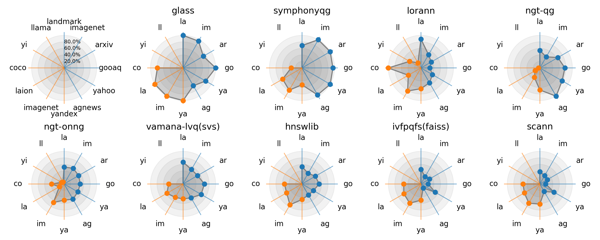

<h1 align="center">VIBE</h1>
<div align="center">
Vector Index Benchmark for Embeddings (VIBE) is an extensible benchmark for approximate nearest neighbor search methods, or vector indexes, using modern embedding datasets.
</div>
<br/>



---

- Modern vector index benchmark with embedding datasets
- Includes datasets for both in-distribution and out-out-distribution settings
- Includes the most comprehensive collection of state-of-the-art vector search algorithms
- Support for quantized datasets in both 8-bit integer and binary precision
- Support for GPU algorithms
- Support for HPC environments with Slurm

### Results

The current VIBE results can be viewed on our website:

https://vector-index-bench.github.io

The website also features several other tools and visualizations to explore the results.

### Credits

The evaluation code and some algorithm implementations in VIBE are based on the [ann-benchmarks](https://github.com/erikbern/ann-benchmarks/) project.

### Datasets

| Name | Type | n | d | Distance |
|---|---|---|---|---|
| [agnews-mxbai-1024-euclidean](https://huggingface.co/datasets/vector-index-bench/vibe/blob/main/agnews-mxbai-1024-euclidean.hdf5) | Text | 769,382 | 1024 | euclidean |
| [arxiv-nomic-768-normalized](https://huggingface.co/datasets/vector-index-bench/vibe/blob/main/arxiv-nomic-768-normalized.hdf5) | Text | 1,344,643 | 768 | any |
| [gooaq-distilroberta-768-normalized](https://huggingface.co/datasets/vector-index-bench/vibe/blob/main/gooaq-distilroberta-768-normalized.hdf5) | Text | 1,475,024 | 768 | any |
| [imagenet-clip-512-normalized](https://huggingface.co/datasets/vector-index-bench/vibe/blob/main/imagenet-clip-512-normalized.hdf5) | Image | 1,281,167 | 512 | any |
| [landmark-nomic-768-normalized](https://huggingface.co/datasets/vector-index-bench/vibe/blob/main/landmark-nomic-768-normalized.hdf5) | Image | 760,757 | 768 | any |
| [yahoo-minilm-384-normalized](https://huggingface.co/datasets/vector-index-bench/vibe/blob/main/yahoo-minilm-384-normalized.hdf5) | Text | 677,305 | 384 | any |
| [celeba-resnet-2048-cosine](https://huggingface.co/datasets/vector-index-bench/vibe/blob/main/celeba-resnet-2048-cosine.hdf5) | Image | 201,599 | 2048 | cosine |
| [ccnews-nomic-768-normalized](https://huggingface.co/datasets/vector-index-bench/vibe/blob/main/ccnews-nomic-768-normalized.hdf5) | Text | 495,328 | 768 | any |
| [codesearchnet-jina-768-cosine](https://huggingface.co/datasets/vector-index-bench/vibe/blob/main/codesearchnet-jina-768-cosine.hdf5) | Code | 1,374,067 | 768 | cosine |
| [glove-200-cosine](https://huggingface.co/datasets/vector-index-bench/vibe/blob/main/glove-200-cosine.hdf5) | Word | 1,192,514 | 200 | cosine |
| [landmark-dino-768-cosine](https://huggingface.co/datasets/vector-index-bench/vibe/blob/main/landmark-dino-768-cosine.hdf5) | Image | 760,757 | 768 | cosine |
| [simplewiki-openai-3072-normalized](https://huggingface.co/datasets/vector-index-bench/vibe/blob/main/simplewiki-openai-3072-normalized.hdf5) | Text | 260,372 | 3072 | any |
| [coco-nomic-768-normalized](https://huggingface.co/datasets/vector-index-bench/vibe/blob/main/coco-nomic-768-normalized.hdf5) | Text-to-Image | 282,360 | 768 | any |
| [imagenet-align-640-normalized](https://huggingface.co/datasets/vector-index-bench/vibe/blob/main/imagenet-align-640-normalized.hdf5) | Text-to-Image | 1,281,167 | 640 | any |
| [laion-clip-512-normalized](https://huggingface.co/datasets/vector-index-bench/vibe/blob/main/laion-clip-512-normalized.hdf5) | Text-to-Image | 1,000,448 | 512 | any |
| [yandex-200-cosine](https://huggingface.co/datasets/vector-index-bench/vibe/blob/main/yandex-200-cosine.hdf5) | Text-to-Image | 1,000,000 | 200 | cosine |
| [yi-128-ip](https://huggingface.co/datasets/vector-index-bench/vibe/blob/main/yi-128-ip.hdf5) | Attention | 187,843 | 128 | IP |
| [llama-128-ip](https://huggingface.co/datasets/vector-index-bench/vibe/blob/main/llama-128-ip.hdf5) | Attention | 256,921 | 128 | IP |

### Algorithms

| Method | Version |
|--------|---------|
| [ANNOY](https://github.com/spotify/annoy) | 1.17.3 |
| [FALCONN++](https://github.com/NinhPham/FalconnPP) | git+5fd3f17 |
| [FlatNav](https://github.com/BlaiseMuhirwa/flatnav) | 0.1.2 |
| [CAGRA](https://github.com/rapidsai/cuvs) | 25.08.00 |
| [GGNN](https://github.com/cgtuebingen/ggnn) | 0.9 |
| [GLASS](https://github.com/zilliztech/pyglass) | 1.0.5 |
| [HNSW](https://github.com/nmslib/hnswlib) | 0.8.0 |
| [IVF (Faiss)](https://github.com/facebookresearch/faiss) | 1.12.0 |
| [IVF-PQ (Faiss)](https://github.com/facebookresearch/faiss) | 1.12.0 |
| [LVQ (SVS)](https://github.com/intel/ScalableVectorSearch) | 0.0.7 |
| [LeanVec (SVS)](https://github.com/intel/ScalableVectorSearch) | 0.0.7 |
| [LoRANN](https://github.com/ejaasaari/lorann) | 0.4 |
| [MLANN](https://github.com/ejaasaari/mlann) | git+f5d966b |
| [MRPT](https://github.com/vioshyvo/mrpt) | 2.0.2 |
| [NGT-ONNG](https://github.com/yahoojapan/NGT/) | git+c245442 |
| [NGT-QG](https://github.com/yahoojapan/NGT/) | git+c245442 |
| [NSG](https://github.com/facebookresearch/faiss) | 1.12.0 |
| [PUFFINN](https://github.com/puffinn/puffinn) | git+fd86b0d |
| [PyNNDescent](https://github.com/lmcinnes/pynndescent) | 0.5.13 |
| [RoarGraph](https://github.com/matchyc/RoarGraph) | git+f2b49b6 |
| [ScaNN](https://github.com/google-research/google-research/tree/master/scann) | 1.4.0 |
| [SymphonyQG](https://github.com/gouyt13/SymphonyQG) | git+32a0019 |
| [Vamana (DiskANN)](https://github.com/microsoft/DiskANN) | 0.7.0 |

## Getting started

### Requirements

- [Apptainer](https://apptainer.org/docs/admin/main/installation.html#install-from-pre-built-packages) (or [Singularity](https://docs.sylabs.io/guides/4.3/user-guide/quick_start.html))
- Python 3.6+

Some algorithms may require that the CPU supports AVX-512 instructions. The GPU algorithms assume that an NVIDIA GPU is available.

### Building library images

Building all library images can be done using
```sh
./install.sh
```

The script can be used to either build images for all available libraries (`./install.sh`) or an image for a single library (e.g. `./install.sh --algorithm faiss`).

> [!TIP]
> `install.sh` takes an argument `--build-dir` that specifies the temporary build directory. For example, to speed up the build in a cluster environment, you can set the build directory to a location on an SSD while the project files are on a slower storage medium.

> [!TIP]
> See an [example Slurm job](slurm/install.sh) for building the libraries using Slurm.

### Running benchmarks

The benchmarks for a single dataset can be run using `run.py`. For example:

```sh
python3 run.py --dataset agnews-mxbai-1024-euclidean
```

The run.py script does not depend on any external libraries and can therefore be used without a container or a virtual environment.

Common options for run.py:
- `--parallelism n`: Use `n` processes for benchmarking.
- `--algorithm algo`: Run the benchmark for only `algo`.
- `--count k`: Run the benchmarks using `k` nearest neighbors (default 100).
- `--gpu`: Run the benchmark in GPU mode.

The benchmark should take less than 24 hours to run for a given dataset using parallelism > 8. We recommend having at least 16 GB of memory per used process.

> [!TIP]
> See an [example Slurm job](slurm/run.sh) for running the benchmark using Slurm.

### Plotting results

You should first build the `plot.sif` image:
```sh
singularity build plot.sif plot.def
```

Before plotting, the current results must first be exported:
```sh
./export_results.sh
```

The results for a dataset can then plotted with e.g.:
```sh
./plot.sh --dataset agnews-mxbai-1024-euclidean
```

To plot the radar chart above, use:
```sh
./plot.sh --plot-type radar
```

For all available options, see:
```
./plot.sh --help
```

You can also use [uv](https://docs.astral.sh/uv/) to directly run `export_results.py` and `plot.py` without building the container image if preferable. The arguments for these scripts are the same as above.

### Creating datasets from scratch

The benchmark code downloads precomputed embedding datasets. However, the datasets can also be recreated from scratch, and it is also possible to create new datasets by modifying the [datasets.py](vibe/datasets.py) file.

Creating the datasets can be done using `create_dataset.sh`. It first requires that `dataset.sif` is built:
```sh
singularity build dataset.sif dataset.def
```

The `VIBE_CACHE` environment variable should be set to a cache directory with at least 200 GB of free space when creating image embeddings using the Landmark or ImageNet datasets. Datasets can then be created using the `--dataset argument` (the `--nv` argument specifies that an available GPU can be used):
```sh
export VIBE_CACHE=$LOCAL_SCRATCH
./create_dataset.sh --singularity-args "--bind $LOCAL_SCRATCH:$LOCAL_SCRATCH --nv" --dataset agnews-mxbai-1024-euclidean
```

> [!TIP]
> See an [example Slurm job](slurm/dataset.sh) for creating datasets using Slurm.

## License

VIBE is available under the MIT License (see [LICENSE](LICENSE)). The [pyyaml](https://github.com/yaml/pyyaml) library is also distributed in the [vibe](vibe) folder under the MIT License.
